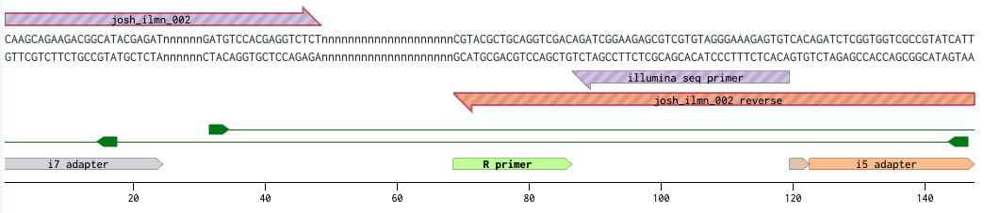

Analysis of barcode sequencing stress resistance experiments

```{r setup, include=FALSE}
knitr::opts_chunk$set(echo = TRUE)
require(kableExtra)

```
# Sequencing QC
* FastQC: read quality is high and uniform across the flow cell
* Good read count and base indexing

# Pre-processing


Unzip the data files, strip out metadata, truncate to barcodes, aggregate by frequency.

The input file barcode_counts.tsv is a tab-separated frequency table extracted from the raw reads. It contains trimmed barcode sequences with more than 1 read.

```{r}
# Load the data
read_counts <- read.delim(file = '../preprocessing/output/barseq_counts.tsv', header = TRUE)

# Check the shape of the data frame
print('Data dimensions, rows x columns')
print(dim(read_counts))
head(read_counts)
```

Each read has an in-line index that denotes its condition and replicate ID.

### Barcode index quality check

```{r}
# Sum all of the reads
read_sum <- sum(read_counts$count)
print('Total reads count')
print(read_sum)

# Sum read counts for each index
index_sums <- aggregate(read_counts$count, by=list(index=read_counts$id), FUN=sum)
colnames(index_sums)[2] <- 'count'
index_sums$fraction <- index_sums$count/read_sum
index_sums <- index_sums[order(index_sums$count, decreasing = TRUE),]
print('Total experiment indices')
print(dim(index_sums)[1])
print('Sum per experiment index')
head(index_sums, n = 20)

# plot each index's count
forplot <- head(index_sums, n = 60)
plot(x = forplot$fraction, main = 'Index Read Counts', ylab = 'Read fraction')

```
18 indices account for a majority of reads. These the correct indices. We will ignore non-exact matches and discard ~23% of the data.

```{r}
id_key <- read.csv('inputs/expt_id_key.csv')
head(id_key)
indexed <- merge(x = read_counts, y = id_key, by = 'id', sort = FALSE, all.x = TRUE, all.y = TRUE)
failed_indexing <- indexed[!complete.cases(indexed),]
print('Fraction of total reads retained in assignment')
indexed_sum <- sum(indexed[complete.cases(indexed),]$count)
all_sum <- sum(indexed$count)
print(indexed_sum / read_sum)
print('Fraction of total reads retained for next step')
print(all_sum / read_sum)

```

## Barcode assignment
### Marge reads with barcode key
```{r} 
# Load keys
barcode_key <- read.csv('inputs/barcode_key.csv')
# Assign barcode keys
assigned_barcodes <- merge(x = indexed, y = barcode_key, by = 'barcode', sort = TRUE, all.x = TRUE, all.y = TRUE)
 
# Write 0 to key elements with no matches
assigned_barcodes[is.na(assigned_barcodes$count),]$count <- 0

# Collect incomplete cases
incompletes <- assigned_barcodes[!complete.cases(assigned_barcodes),]

# Get rid of incomplete cases
assigned_barcodes <- assigned_barcodes[complete.cases(assigned_barcodes),]

```


Assign gene common names and descriptions
```{r} 
# Load gene descriptions and common names from SGD file. DONT EDIT IN EXCEL. It converts gene names to dates.
gene_descriptions <- read.csv('inputs/gene_descriptions.csv', stringsAsFactors = FALSE)
# Keep good columns
gene_descriptions <- gene_descriptions[,c(3,4,5)]
# Rename columns
colnames(gene_descriptions) <- c('gene', 'common', 'description')
# Get rid of blank rows
gene_descriptions <- gene_descriptions[!gene_descriptions$gene=='',]
# Make the common name of anything without a common name equal its systematic name
gene_descriptions[gene_descriptions$common=='',]$common <- gene_descriptions[gene_descriptions$common=='',]$gene
# Add the names to the dataframe
named_barcodes <- merge(assigned_barcodes, gene_descriptions, 'gene', all.x = TRUE, all.y = FALSE)
# Cache the dataframe
save(named_barcodes, file='outputs/named_barcodes.rdata')
head(named_barcodes)
```

### Barcode assignment QC
```{r, message=FALSE, warning=FALSE}
require(ggplot2)
require(ggthemes)
require(ggpubr)
require(RColorBrewer)
require(ggrepel)
theme_set(theme_pubr())
palette <- 'Set2'

forplot <- aggregate(count~id+condition, named_barcodes,FUN=median)
ggplot(forplot, aes(x = id, y=count, fill=condition)) + ggtitle('Median reads per gene by experiment') + geom_bar(stat='identity') +xlab('Experiment ID') + scale_fill_brewer(palette = palette) + scale_color_brewer(palette = palette)

forplot <- aggregate(count~id+condition, named_barcodes,FUN=sum)
ggplot(forplot, aes(x = id, y=count, fill=condition)) + ggtitle('Total reads per experiment') + geom_bar(stat='identity') +xlab('Experiment ID') + scale_fill_brewer(palette = palette) + scale_color_brewer(palette = palette)

forplot <- aggregate(count~id+condition, named_barcodes,FUN=sd)
ggplot(forplot, aes(x = id, y=count, fill=condition)) + ggtitle('SD within experiment') + geom_bar(stat='identity') +xlab('Experiment ID') + ylab('SD') + scale_fill_brewer(palette = palette) + scale_color_brewer(palette = palette)

forplot <- aggregate(count~common+condition, named_barcodes,FUN=mean)
forplot <- forplot[order(forplot$count, decreasing = TRUE),]
plot <- ggplot(forplot, aes(x = common, y=count, color=condition)) + ggtitle('Mean between replicates by gene') + geom_point() +xlab('Gene') + ylab('Mean read count') + scale_fill_brewer(palette = palette) + scale_color_brewer(palette = palette) +theme(axis.text.x=element_blank(),
            axis.ticks.x=element_blank()) # + geom_text(aes(label=common), vjust=-1)
plot

forplot <- named_barcodes
forplot <- aggregate(count~common+condition, named_barcodes, FUN =mean)
forplot$sd <- aggregate(count~common+condition, named_barcodes, FUN =sd)$count
forplot$cv <- forplot$sd / forplot$count
forplot <- forplot[order(forplot$cv, decreasing = TRUE),]
plot <- ggplot(forplot, aes(x = common, y=cv, color=condition)) + ggtitle('Coefficient of variation replicates by gene') + geom_point() +xlab('Gene') + ylab('CV') + scale_fill_brewer(palette = palette) + scale_color_brewer(palette = palette) + theme(axis.text.x=element_blank(),
            axis.ticks.x=element_blank())# + geom_text(aes(label=common), vjust=-1)
plot

forplot <- aggregate(count~common+condition, named_barcodes,FUN=sd)
plot <- ggplot(forplot,
      aes(x = common, y=count, fill=condition, color=condition)) +
      ggtitle('SD between replicates by gene') +
      geom_point() +
      geom_text_repel(fontface = 'bold',
                data=subset(forplot, count > 3e4),
                aes(x=common, y=count, label=common),
                force = 20)
plot

```

Is there bias by plate position in MoBY library?
```{r} 
# Order by plate and well name
ordered <- assigned_barcodes
ordered$plate <- paste(assigned_barcodes$plate, assigned_barcodes$well)
head(ordered)
tail(ordered)
ggplot(ordered, aes(x=plate, y=count, color=condition)) +
      geom_point() +
      ylab('Reads') + 
      xlab('Genes, ordered by plate position') +
      theme(legend.position = "right") +
      ggtitle('Reads per gene by plate position')
      
```
There does not appear to be a trend here.


### Statistics

Assess differential abundance with a binomial exact test

Prepare the data matrix for the differential expression tests
```{r, message=FALSE, warning=FALSE}
# These analysis libraries require data in a data.matrix format, with rows as gene names, columns experiment conditions, and all data in the table as numeric. Can not have NAs for genes. These will be filtered out.
count_matrix <- assigned_barcodes
# Give each condition a unique ID by condition and replicate

# Drop metadata columns
count_matrix <- count_matrix[,c(3,4,7)]

# Convert to wide format with each experiment count as a column
count_matrix <- reshape(data = count_matrix, idvar = 'gene', direction = 'wide', timevar='index')

# Name rows as genes and remove gene name column
rownames(count_matrix) <- count_matrix[,1]
count_matrix <- count_matrix[,-1]

# Name columns as exp id numbers
colnames(count_matrix) <- as.numeric(gsub("count.", "", colnames(count_matrix)))

# Sort columns by experiment id
count_matrix <- count_matrix[ , order(as.numeric(names(count_matrix)))]

# Convert from class dataframe to class matrix
count_matrix <- data.matrix(count_matrix)

# Make a matrix with NAs
NA_matrix <- count_matrix[!complete.cases(count_matrix),]

# Remove NAs
count_matrix <- count_matrix[complete.cases(count_matrix),]

# Cache the matrix
save(count_matrix, file='outputs/count_matrix.rdata')
head(count_matrix)
```

### Perform dispersion analysis and binomial exact tests

Experiment ID reference chart
1. YPD (control)
2. Oxidative stress
3. Osmotic stress (glycerol)
4. Freeze-thaw stress
5. mtDNA_t1
6. mtDNA_t2


```{r, message=FALSE, warning=FALSE}
library(edgeR)

# Declare the sample replicate groups
group <- c(1,1,1,2,2,2,3,3,3,4,4,4,5,5,5,6,6,6)
samples <- colnames(count_matrix)

# Dispersion estimates (copied from reference publication)
count_matrix <- DGEList(counts = count_matrix, group = group, samples = samples,)
count_matrix = estimateCommonDisp(count_matrix)
count_matrix = estimateTagwiseDisp(count_matrix)

# Calculate differential expression for each experiment
# Note that some experiments do not use the 'control' group as a control
        # Oxidation result
        result = exactTest(count_matrix, pair=c(1, 2))
        ox <- result$table
        colnames(ox) <- paste('ox', colnames(ox), sep='_')
        ox$ox_PValue <- ox$ox_PValue
        ox$ox_FDR <- p.adjust(ox$ox_PValue, method = "BH")
        
        # Osmotic stress table
        result = exactTest(count_matrix, pair=c(1, 3))
        os <- result$table
        colnames(os) <- paste('os', colnames(os), sep='_')
        os$os_PValue <- os$os_PValue
        os$os_FDR <- p.adjust(os$os_PValue, method = "BH")
        
        # Freeze-thaw table, control is glycerol condition
        result = exactTest(count_matrix, pair=c(3, 4))
        fr <- result$table
        colnames(fr) <- paste('fr', colnames(fr), sep='_')
        fr$fr_PValue <- fr$fr_PValue
        fr$fr_FDR <- p.adjust(fr$fr_PValue, method = "BH")
      
        # Osmo and Freeze-thaw table, control is glycerol condition
        result = exactTest(count_matrix, pair=c(1, 4))
        of <- result$table
        colnames(of) <- paste('of', colnames(of), sep='_')
        of$of_PValue <- of$of_PValue
        of$of_FDR <- p.adjust(of$of_PValue, method = "BH")
        
      # mtDNA_t1
      result = exactTest(count_matrix, pair=c('1', '5'))
      m1 <- result$table
      colnames(m1) <- paste('m1', colnames(m1), sep='_')
      m1$m1_PValue <- m1$m1_PValue
      m1$m1_FDR <- p.adjust(m1$m1_PValue, method = "BH")
      
      # mtDNA_t2
      result = exactTest(count_matrix, pair=c('5', '6'))
      m2 <- result$table
      colnames(m2) <- paste('m2', colnames(m2), sep='_')
      m2$m2_PValue <- m2$m2_PValue
      m2$m2_FDR <- p.adjust(m2$m2_PValue, method = "BH")
      
# Combine DE analysis results
differential_expression <- cbind(ox, os, fr, of, m1, m2)
head(differential_expression, n = 5)
save(differential_expression, file = 'outputs/differential_expression.rdata')
```

### Convert differential expression marix back to dataframe format for analysis
```{r}
library(reshape2)
library(tidyr)
library(ggplot2)
library(dplyr)
# Load differential expression data
load('outputs/differential_expression.rdata')
# Convert from matrix to data.frame. Note new name = de_results
de_results <- data.frame(differential_expression)
# Move rownames to a new column
de_results$gene <- rownames(de_results)
# Mellt the dataframe to a long format with variables indicating the value type
de_results <- melt(de_results, id=c('gene' ))
# Convert variable type to a string for parsing
de_results$variable <- as.character(de_results$variable)
# Split the value type into experiment condition and stat type, remove concatenated varaible
de_results$condition <- sapply(strsplit(de_results$variable, '_',), "[[", 1)
de_results$stat <- sapply(strsplit(de_results$variable, '_',), "[[", 2)
de_results <- de_results[,-2]
# Give each stat type its own column
de_results <- dcast(de_results, gene+condition~stat)
de_results <- merge(de_results, gene_descriptions, by = 'gene')
de_results[de_results$common == '',]$common <- de_results[de_results$common == '',]$gene
save(de_results, file='outputs/de_results.rdata')
head(de_results)
```

```{r, message=FALSE, warning=FALSE}
library(ggplot2)
library(ggrepel)
library(ggthemes)
library(ggpubr)
theme_set(theme_pubr())

load('outputs/de_results.rdata')
pval_cutoff <- 0.05

# Main volcano plot
forplot <- de_results
plot <- ggplot(data = forplot, aes()) +
        geom_point(aes(x=logFC, y=-log(PValue), color=condition)) +
        geom_hline(yintercept=-log(pval_cutoff), color='red') + # Horizontal line for pval cutoff
        scale_colour_discrete("Condition", labels = c('Freeze-thaw', 'EtBr Treatment', 'rho0 growth', 'Osmotic stress', 'Oxidative stress')) +
        theme(legend.position = 'right') +
        theme(plot.title = element_text(hjust=0.5)) +
        xlab('log(Fold-chage)') +
        ylab('log(P-value)') +
        ggtitle('Differential Barcode Frequencies') +
        geom_text_repel(
                        fontface = 'bold',
                        data=subset(forplot,
                                abs(logFC) > 5  & PValue < pval_cutoff),
                        aes(x=logFC, y=-log(PValue),
                        label=common),
                        force = 20,
                        show.legend = FALSE)
plot
```

### Oxidative stress

```{r, message=FALSE, warning=FALSE}
forplot <- de_results[de_results$condition %in% c('ox'),]
pval_cutoff <- 0.05
plot <- ggplot(data = forplot, aes()) +
        geom_point(aes(x=logFC, y=-log(PValue)), color='blue') +
        geom_hline(yintercept=-log(pval_cutoff), color='red') + # Horizontal line for pval cutoff
        theme(plot.title = element_text(hjust=0.5)) +
                theme(legend.position = "none") +
        xlab('log2(Fold-chage)') +
        ylab('-log10(P-value)') +
        ggtitle(label = '') +
        geom_text_repel(
                fontface = 'bold',
                data=subset(forplot,
                        (abs(logFC) > log(2)  & PValue < pval_cutoff) | (PValue < 0.01)),
                aes(x=logFC, y=-log(PValue),
                label=common),
                force = 20,
                show.legend = FALSE)
plot
ggsave(plot, filename = 'outputs/oxidation.png')


```

```{r, echo=FALSE}
library(kableExtra)
# Make a hit table
forplot <- subset(forplot, PValue < pval_cutoff)
forplot <- forplot[order(forplot$logFC, decreasing = TRUE),]
kbl(forplot) %>%
  kable_paper(full_width = T, c("hover")) %>%
  scroll_box(height = "300px")
```

### Osmotic stress
```{r, message=FALSE, warning=FALSE}
forplot <- de_results[de_results$condition %in% c('os'),]
plot <- ggplot(data = forplot, aes()) +
        geom_point(aes(x=logFC, y=-log(PValue)), color='blue') +
        geom_hline(yintercept=-log(pval_cutoff), color='red') + # Horizontal line for pval cutoff
        theme(plot.title = element_text(hjust=0.5)) +
                theme(legend.position = "none") +
        xlab('log2(Fold-chage)') +
        ylab('-log10(P-value)') +
        #xlim(-1,1) +
        geom_text_repel(
                fontface = 'bold',
                data=subset(forplot,
                        (PValue < pval_cutoff)),
                aes(x=logFC, y=-log(PValue),
                label=common),
                force = 20,
                show.legend = FALSE) +
        ggtitle(label = '')+
      xlim(-1, 1)
      
plot
ggsave(plot, filename = 'outputs/osmotic.png')


#plot + xlim(-1,1)
```

```{r, echo=FALSE}
# Make a hit table
forplot <- subset(forplot, PValue < pval_cutoff)
forplot <- forplot[order(forplot$logFC, decreasing = TRUE),]
kbl(forplot) %>%
  kable_paper(full_width = T, c("hover")) %>%
  scroll_box(height = "300px")
```

### Freeze-thaw
```{r, message=FALSE, warning=FALSE}
forplot <- de_results[de_results$condition %in% c('fr'),]
pval_cutoff <- 0.05
plot <- ggplot(data = forplot, aes()) +
        geom_point(aes(x=logFC, y=-log(PValue)), color='blue') +
        geom_hline(yintercept=-log(pval_cutoff), color='red') + # Horizontal line for pval cutoff
        theme(plot.title = element_text(hjust=0.5)) +
                theme(legend.position = "none") +
        xlab('log2(Fold-chage)') +
        ylab('-log10(P-value)') +
        ggtitle(label = '') +
        geom_text_repel(
                fontface = 'bold',
                data=subset(forplot,
                        PValue < 0.05),
                aes(x=logFC, y=-log(PValue),
                label=common),
                force = 20,
                show.legend = FALSE)
plot

ggsave(plot, filename = 'outputs/freeze.png')


forplot <- de_results[de_results$condition %in% c('of'),]
pval_cutoff <- 0.05
plot <- ggplot(data = forplot, aes()) +
        geom_point(aes(x=logFC, y=-log(PValue)), color='blue') +
        geom_hline(yintercept=-log(pval_cutoff), color='red') + # Horizontal line for pval cutoff
        theme(plot.title = element_text(hjust=0.5)) +
                theme(legend.position = "none") +
        xlab('log2(Fold-chage)') +
        ylab('-log10(P-value)') +
        ggtitle(label = '') +
        geom_text_repel(
                fontface = 'bold',
                data=subset(forplot,
                        PValue < 0.1),
                aes(x=logFC, y=-log(PValue),
                label=common),
                force = 20,
                show.legend = FALSE)
plot

ggsave(plot, filename = 'outputs/os-freeze.png')


```

```{r, echo=FALSE}
# Make a hit table
forplot <- subset(forplot, PValue < pval_cutoff)
forplot <- forplot[order(forplot$logFC, decreasing = TRUE),]
kbl(forplot) %>%
  kable_paper(full_width = T, c("hover")) %>%
  scroll_box(height = "300px")
```


### Ethidium Bromide Treatment
```{r, message=FALSE, warning=FALSE}
pval_cutoff <- 0.01
forplot <- de_results[de_results$condition %in% c('m1'),]
plot <- ggplot(data = forplot, aes()) +
        geom_point(aes(x=logFC, y=-log(PValue)), color='#00cc99') +
        geom_hline(yintercept=-log(pval_cutoff), color='red') + # Horizontal line for pval cutoff
        theme(plot.title = element_text(hjust=0.5)) +
        #theme(plot.subtitle  = element_text(hjust=0.5)) +
                theme(legend.position = "none") +
        xlab('log(Fold-chage)') +
        ylab('log(P-value)') +
        #xlim(-1,1) +
        ggtitle(label = 'Ethidium Bromide Treatment Differential Barcode Frequencies') +
        geom_text_repel(
                fontface = 'bold',
                data=subset(forplot,
                        (PValue < pval_cutoff & abs(logFC) > log(3)) | (-log(PValue) > 10)),
                aes(x=logFC, y=-log(PValue),
                label=common),
                force = 20,
                show.legend = FALSE)
plot
```

```{r, echo=FALSE}
# Make a hit table
forplot <- subset(forplot, PValue < pval_cutoff)
forplot <- forplot[order(forplot$logFC, decreasing = TRUE),]
kbl(forplot) %>%
  kable_paper(full_width = T, c("hover")) %>%
  scroll_box(height = "300px")
```


### Proliferation of cells lacking mtDNA (rho0)
```{r}
pval_cutoff <- 1e-60
forplot <- de_results[de_results$condition %in% c('m2'),]
plot <- ggplot(data = forplot, aes()) +
        geom_point(aes(x=logFC, y=-log(PValue)), color='#00cc99') +
        geom_hline(yintercept=-log(0.05), color='red') + # Horizontal line for pval cutoff
        theme(plot.title = element_text(hjust=0.5)) +
        #theme(plot.subtitle  = element_text(hjust=0.5)) +
                theme(legend.position = "none") +
        xlab('log(Fold-chage)') +
        ylab('log(P-value)') +
        #xlim(-1,1) +
        ggtitle(label = 'Differential Barcode Frequencies \n Proliferation Lacking mtDNA') +
        geom_text_repel(
                fontface = 'bold',
                data=subset(forplot,
                        PValue < pval_cutoff | abs(logFC) > log(75)),
                aes(x=logFC, y=-log(PValue),
                label=common),
                force = 20,
                show.legend = FALSE)
plot
```

```{r, echo=FALSE}
# Make a hit table
forplot <- subset(forplot, PValue < pval_cutoff)
forplot <- forplot[order(forplot$logFC, decreasing = TRUE),]
kbl(forplot) %>%
  kable_paper(full_width = T, c("hover")) %>%
  scroll_box(height = "300px")
```

### All non-mtDNA stresses 
```{r}
pval_cutoff <- 0.05
forplot <- de_results[de_results$condition %in% c('ox', 'os', 'fr'),]
plot <- ggplot(data = forplot, aes()) +
        geom_point(aes(x=logFC, y=-log(PValue), color=condition)) +
        geom_hline(yintercept=-log(pval_cutoff), color='red') + # Horizontal line for pval cutoff
        theme(plot.title = element_text(hjust=0.5)) +
        theme(legend.position = "right") +
        xlab('log(Fold-chage)') +
        ylab('log(P-value)') +
        scale_color_discrete("Condition", labels = c('Freeze-thaw', 'Osmotic stress', 'Oxidative stress')) +

        ggtitle(label = 'Differential Barcode Frequencies \n Proliferation Lacking mtDNA') +
        geom_text_repel(
                fontface = 'bold',
                data=subset(forplot,
                        (PValue < 1e-99 & abs(logFC) > log(200))),
                aes(x=logFC, y=-log(PValue),
                label=common),
                force = 20,
                show.legend = FALSE)
plot
```


### Save some tables for publication
```{r}
counts_out <- subset(assigned_barcodes, condition %in% c('control', 'mtDNA_t1', 'mtDNA_t2'))
write.csv(file = 'outputs/counts_out.csv', x = counts_out)

de_out <- subset(de_results, condition %in% c('m1', 'm2'))
write.csv(file = 'outputs/de_out.csv', x = de_out)
```
